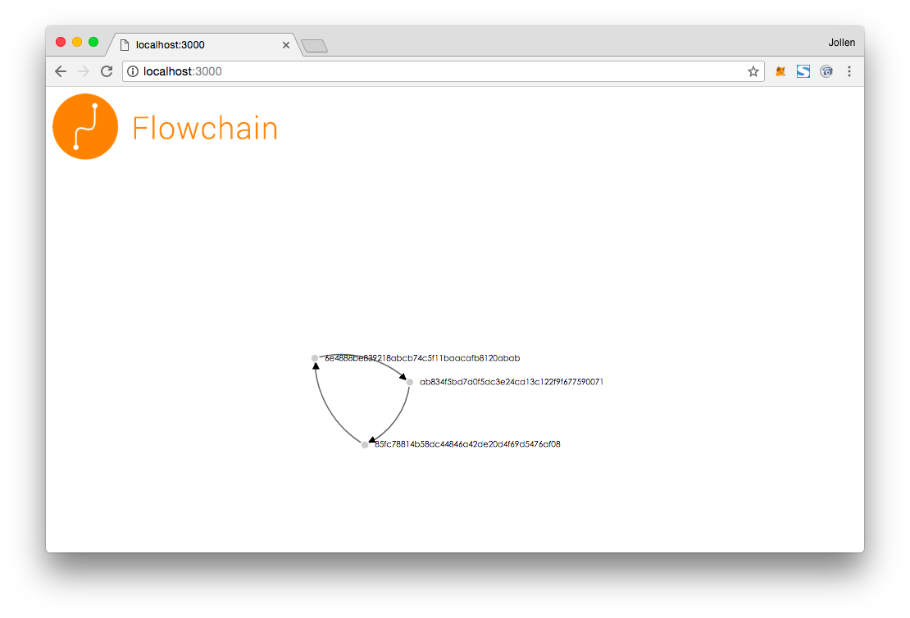

The `flowchain-sim` tool.

# Introduction

`flowchain-sim` (Flowchain Simulator) is a simple tool to watch the p2p network of Flowchain IoT nodes.

# Install

```
$ git clone https://github.com/flowchain/flowchain-sim.git
$ cd flowchain-sim
$ npm i
```

# How to Use



Please open a terminal and start the debug server:

```
$ export HOST=192.168.124.4
$ export PORT=9009
$ node index.js 
WoT/WebSocket server is listening at ws://192.168.124.4:9009
```

The environment variables:

* `HOST`: the listening host
* `PORT`: the listening port

After starting the debug server, please modify `dist/index.html` by placing the debug server IP address and port number:

```
var client = new WebSocket( 'ws://192.168.124.4:9009/node/00000000/viewer' );
```

Start a web server locally:

```
$ http-server dist/ -p 3000
Starting up http-server, serving dist/
Available on:
  http://127.0.0.1:3000
  http://192.168.124.4:3000
Hit CTRL-C to stop the server
```

You can install `http-server` by executing `npm i http-server -g`. Open the debug application with your browser by the the url `http://127.0.0.1:3000`.


# License

flowchain-sim is released under the [MIT License](http://www.opensource.org/licenses/MIT). See [LICENSE.md](LICENSE.md).
